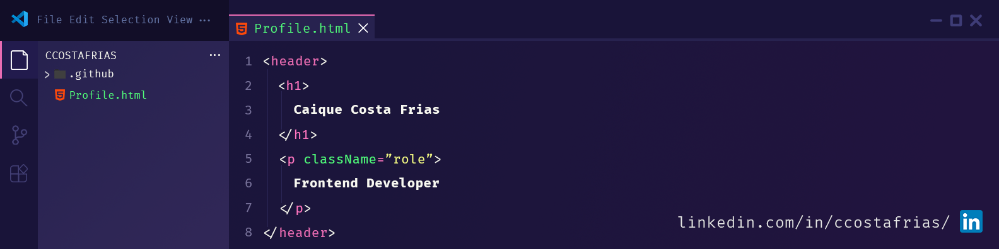

# Hi there, I'm Caique Costa Frias 👋

---

## 🎮 About Me

- 🎓 Information Systems student at USP (University of São Paulo)
- 🎨 Passionate about building clean, functional, responsive layouts
- ⚛️ Currently focused on frontend — especially within the React ecosystem
- 🏆 2nd place at BXCOMP 2025, a programming competition for first-year SI students
- 🕹️ Member of Conway, a student group at USP focused on Computer Graphics and game development
---

## 🛠️ Tools & Technologies

### **Frontend**

  

### **Backend**

  

### **Tools**

  

---

## 🐍 My Commits

  

###

---

## 🌐 Socials

  
  
  

---

 Made with 🤍 by Caique Costa Frias 
